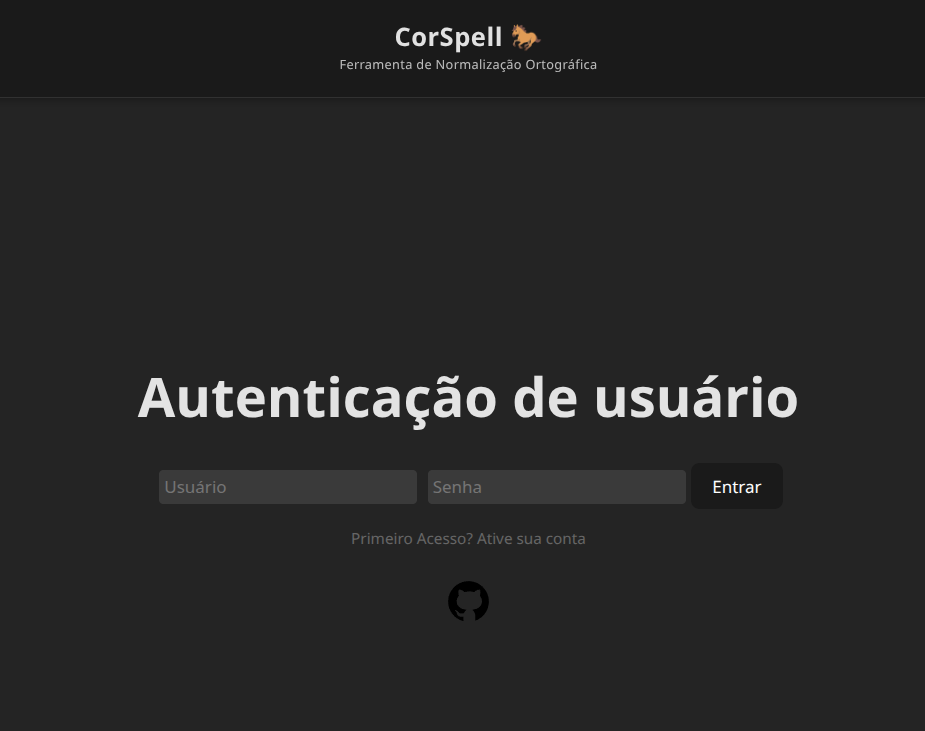
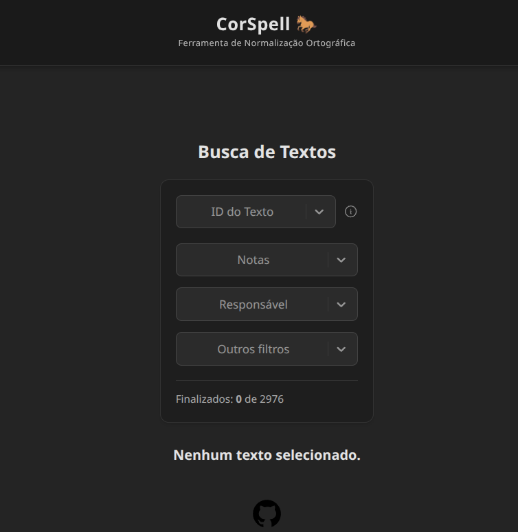

# Corcel Platform

**Corcel Platform** is a modular platform designed to automate the detection of spelling variants and suggestion of form replacements for Brazilian Portuguese texts in order to normalize spelling. Once completed, it will allow researchers and educators to analyze, grade, and improve essays using a pre-existing corpus, with a modern web interface and robust backend.




---

## Features

- **Corpus Integration:** Works with a dataset of graded essays and form replacement candidates for unknown tokens.
- **User Interface:** Responsive web interface built with **React**.
- **Backend API:** Powered by **Flask** for managing normalization and user interaction.
- **Database:** Uses **Postgres** for essays, users, grades, candidates and user input data.
- **Deployment:** Containerized with **Docker** and served via **Nginx** for scalable, reproducible deployments.

## Architecture

- `frontend/`: React app for user interaction.
- `api/`: Flask-based API for data processing and communication.
- `backups/`: (Optional) Backups and migration scripts.
- `docker-compose.yml`: Orchestrates multi-container deployment (frontend, backend, database, nginx).
- `images/`: Static images for documentation and UI.

## Use Case

The platform is ideal for:
- Researchers in natural language processing for Portuguese.
- Analysis of brazilian portuguese texts.
- Anyone seeking to analyze and improve large volumes of written Brazilian Portuguese.

## Quick Start

> **Note:** This project does not include the original private database due to sensitive data. The public repo demonstrates architecture, UI, and integration points.

1. Clone the repository:
   ```bash
   git clone https://github.com/jhssilv/corcel-platform.git
   cd corcel-platform
   ```
2. Copy or create your own Postgres database and update connection info in `docker-compose.yml` and backend configuration.
3. Start the platform:
   ```bash
   docker-compose up --build
   ```
4. Access the web interface at `http://localhost:8080`.

For a detailed setup and development guide, see [HOWTO.md](HOWTO.md).

## Contributing

Pull requests, bug reports, and feature suggestions are welcome! Please open an issue first to discuss major changes.

---

## Disclaimer

**This version is for demonstration and development.** It does not include the proprietary database used in production.
