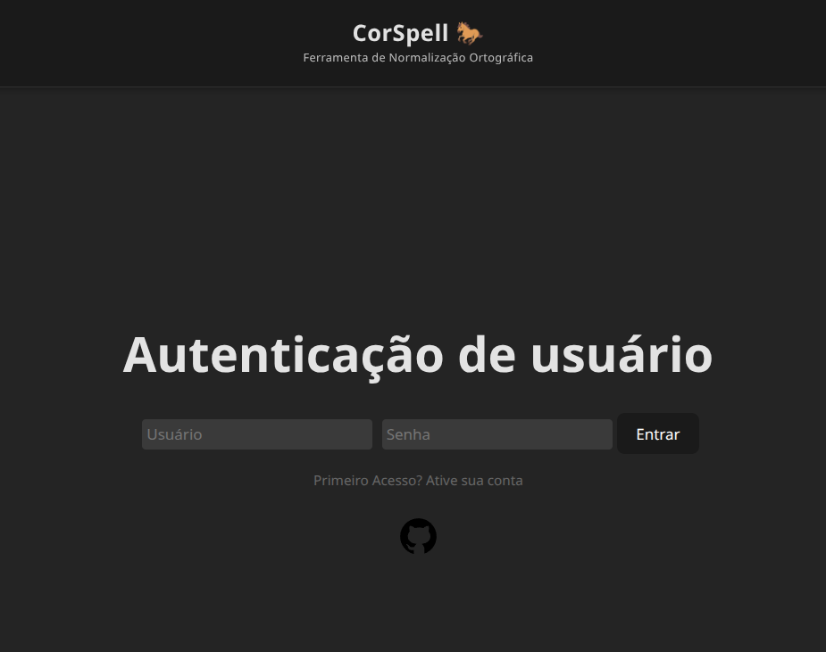
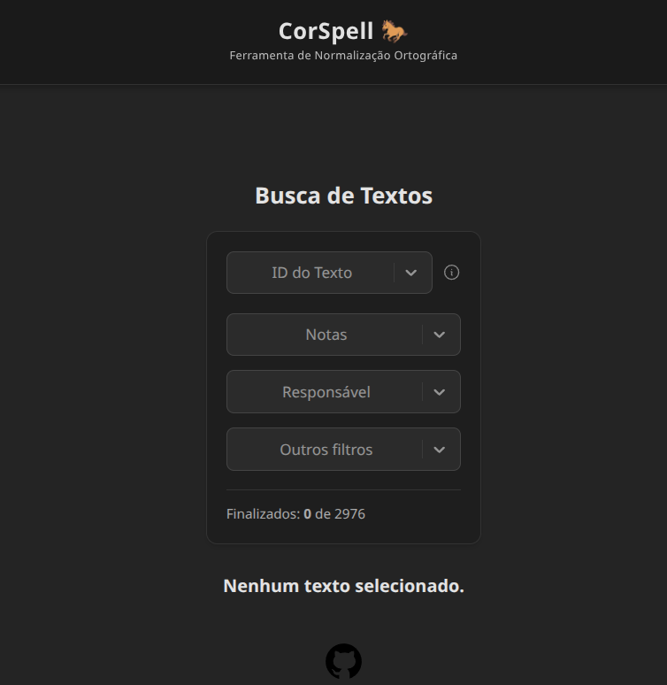
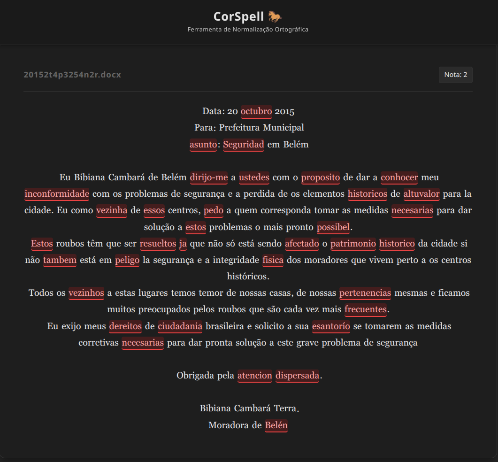

# Corspell

**Corspell** is a modular application designed to automate the detection of non-standard words and the generation of  form replacements for Brazilian Portuguese texts in order to normalize spelling. Thought it is still under development, we aimed at a design that allows others developers and researchers to easily swap, customize and modify core features, like our [text processing pipeline](api/docs/text-processing-pipeline.md).

---

## Features

### Text processing and normalization
CorSpell currently supports the upload of zipped batches of text files in `txt` and `docx` formats. Once uploaded, these go through a customizeable processing pipeline, further detailed [here](api/docs/text-processing-pipeline.md), and is then made available to users for normalization. 

### OCR processing
This application currently supports OCR processing via the Gemini API. Though completely optional, it is suitable for users that need to more easily transcribe and review large quantites of digitized handwritten documents.
