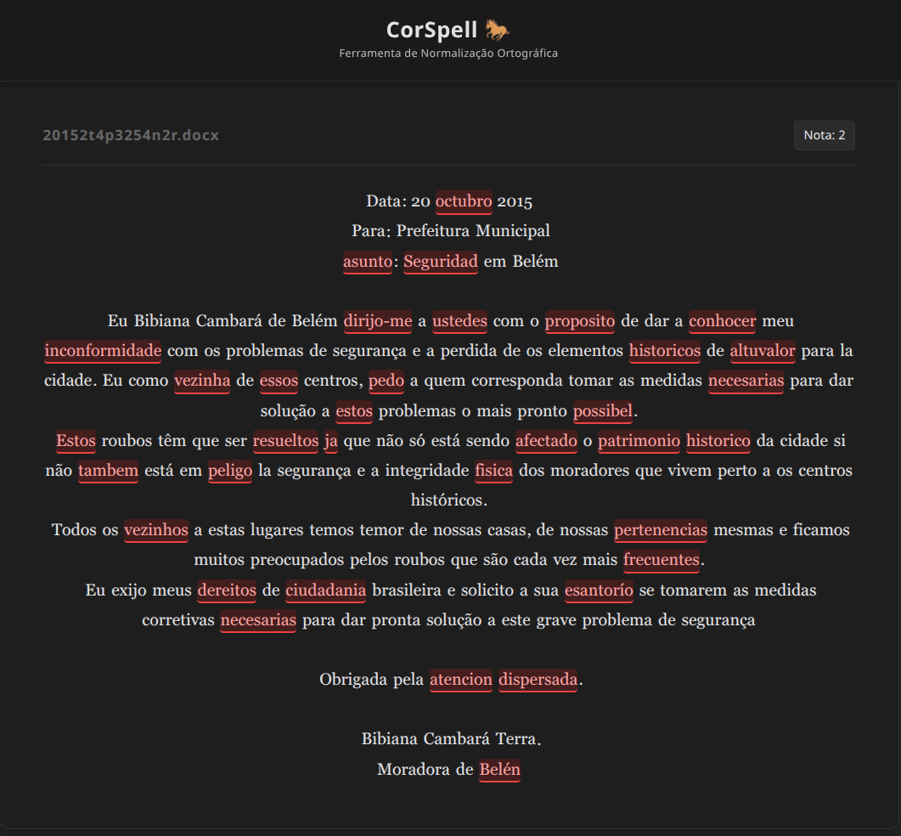

# Corspell

**Corspell** is a modular application designed to automate the detection of non-standard words and the generation of  form replacements for Brazilian Portuguese texts in order to normalize spelling. Thought it is still under development, we aimed at a design that allows others developers and researchers to easily swap, customize and modify core features, like our [text processing pipeline](api/docs/text-processing-pipeline.md).




---

## Features

### Text processing and normalization
CorSpell currently supports the upload of zipped batches of text files in `txt` and `docx` formats. Once uploaded, these go through a customizeable processing pipeline, further detailed [here](api/docs/text-processing-pipeline.md), and is then made available to users for normalization. 

### OCR processing
This application currently supports OCR processing via the Gemini API. Though completely optional, it is suitable for users that need to more easily transcribe and review large quantites of digitized handwritten documents.

## Documentation (WIP)
The documentation for Corspell is available [here](api/docs/README.md). It includes detailed information about the architecture, design decisions, and implementation of the application, as well as instructions for installation and usage. 

## Docker Runtime Modes

For local development, the default Docker stack is defined in `docker-compose.local.yml`.

### Local AMD GPU with native Windows Ollama

Use native Ollama on Windows and point the app containers to the host machine:

```bash
ollama serve
docker compose -f docker-compose.local.host-ollama.yml up --build -d
```

This mode is intended for local AMD machines. It does not start the containerized `ollama` services; the backend and worker talk directly to the host Ollama instance at `host.docker.internal:11434`.

### Local containerized Ollama

If you want the local stack to run Ollama inside Docker instead, use:

```bash
docker compose -f docker-compose.local.yml up --build -d
```

### Production NVIDIA override

On NVIDIA hosts, add the dedicated override:

```bash
docker compose -f docker-compose.yml -f docker-compose.nvidia.yml up --build -d
```
