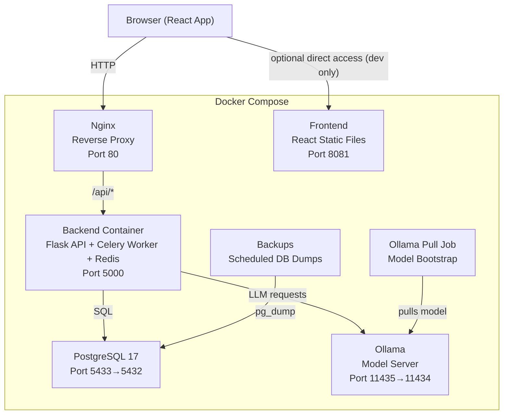
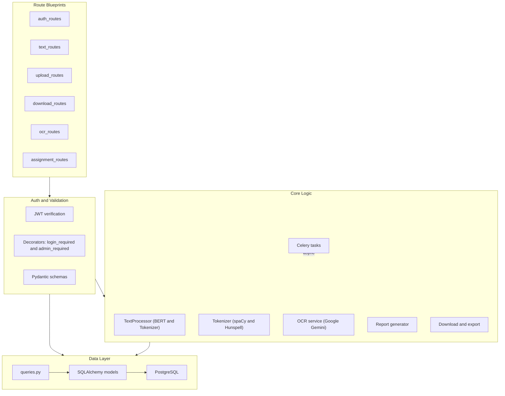
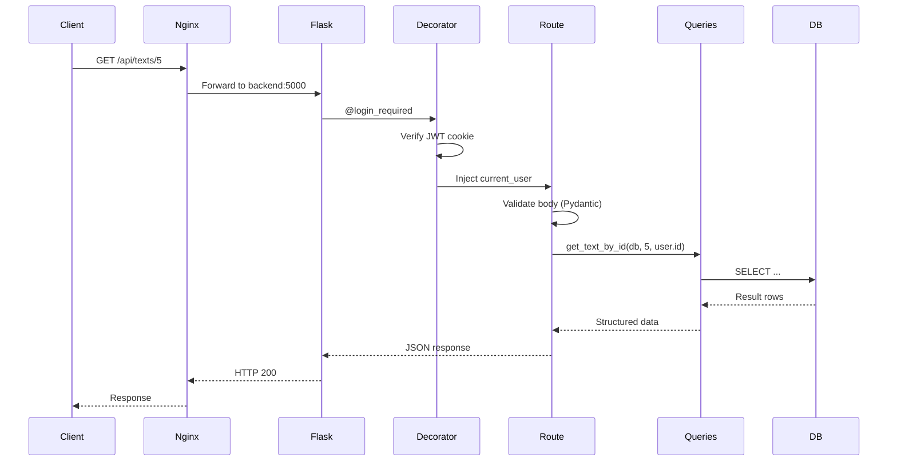
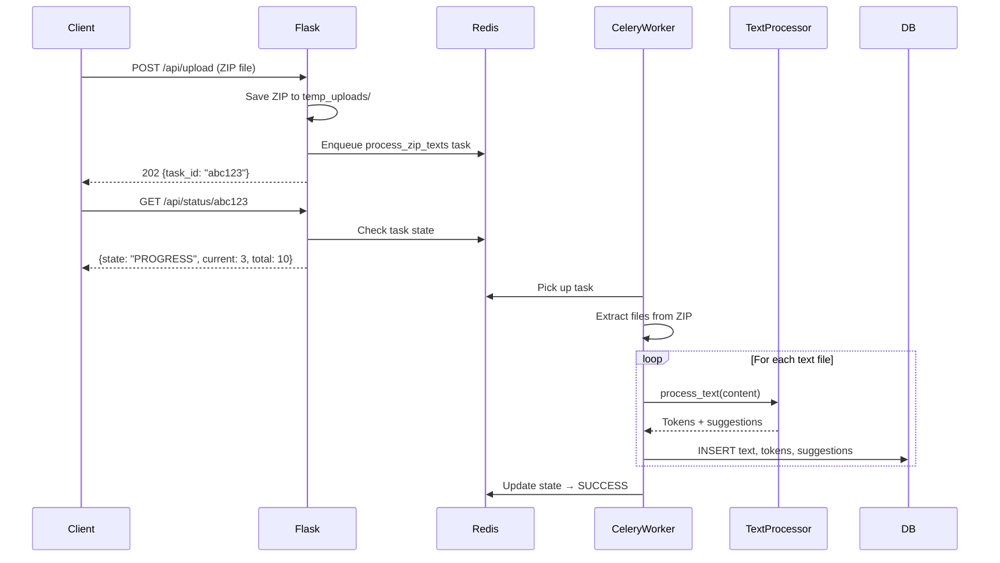

# Backend Architecture

This document describes the high-level architecture of the Corcel Platform backend. It is intended for developers who want to understand, extend, or adapt the system for their own purposes.

---

## System Overview

Corcel Platform is a web application for **automated detection of spelling variants** and **suggestion of normalization replacements** in Brazilian Portuguese texts. The backend is a Python **Flask** application that:

- Exposes a REST API consumed by a React frontend
- Processes and tokenizes Portuguese texts using NLP tools (spaCy, Hunspell, BERT)
- Performs OCR on images using Google Gemini
- Runs long-running tasks asynchronously via Celery workers
- Stores all data in a PostgreSQL database

---

## Service Topology

In production, the platform runs as a set of Docker containers orchestrated by Docker Compose:



The direct client-to-frontend path on port `8081` is intended for development workflows only.

| Service               | Container              | Description                                                                                                      |
| --------------------- | ---------------------- | ---------------------------------------------------------------------------------------------------------------- |
| **Nginx**       | `corcel_nginx`       | Reverse proxy. Routes `/api/*` to the backend and serves static frontend assets from mounted `frontend/dist` |
| **Frontend**    | `corcel_frontend`    | React frontend service available on port `8081`                                                                |
| **Backend**     | `corcel_backend`     | Flask API, Celery worker, and Redis — all in one container                                                      |
| **Database**    | `corcel_db`          | PostgreSQL 17 with persistent volume (`postgres_data`)                                                         |
| **Ollama**      | `corcel_ollama`      | Local model server used by the backend                                                                           |
| **Ollama Pull** | `corcel_ollama_pull` | One-shot job that pulls required models into the shared Ollama volume                                            |
| **Backups**     | `corcel_backups`     | Runs scheduled `pg_dump` scripts against the database                                                          |

> [!NOTE]
> The backend container starts **Redis**, the **Celery worker**, and the **Flask API** at runtime via [`start.sh`](../start.sh). Redis is started as a daemon, Celery runs in the background, and Flask runs in the foreground.

---

## Backend Internal Architecture

The Flask application follows a **layered architecture** with clear separation of concerns:



---

## Directory Structure

```
api/
├── .env                        # Environment variables for local/dev
├── .env.template               # Environment template
├── app/
│   ├── app.py                  # Flask application factory (create_app)
│   ├── config.py               # Configuration class (env vars)
│   ├── extensions.py           # Shared extension instances (db, celery, jwt, bcrypt)
│   ├── logging_config.py       # Rotating file logger for downloads
│   ├── tasks.py                # Celery tasks (ZIP processing, OCR processing)
│   ├── text_processor.py       # BERT-based text processing and suggestions
│   ├── tokenizer.py            # spaCy/Hunspell tokenization and spell-checking
│   ├── generate_report.py      # CSV report generation
│   ├── download_texts.py       # Export normalized texts to ZIP
│   ├── __init__.py
│   ├── routes/                 # Flask blueprints by domain
│   │   ├── auth_routes.py
│   │   ├── text_routes.py
│   │   ├── upload_routes.py
│   │   ├── download_routes.py
│   │   ├── ocr_routes.py
│   │   └── assignment_routes.py
│   ├── schemas/                # Pydantic request/response models
│   │   ├── auth.py
│   │   ├── download.py
│   │   ├── generic.py
│   │   ├── normalization.py
│   │   ├── text.py
│   │   ├── user.py
│   │   └── whitelist.py
│   ├── database/               # Data access layer
│   │   ├── connection.py
│   │   ├── models.py
│   │   └── queries.py
│   ├── services/
│   │   └── ocr_service.py
│   ├── utils/
│   │   └── decorators.py
│   └── dicts/
│       ├── br-utf8.json
│       └── br-utf8.txt
├── docs/                       # Backend documentation
│   ├── api-reference.md
│   ├── architecture.md
│   ├── async-tasks.md
│   ├── authentication.md
│   └── database.md
├── logs/                       # Runtime logs
├── temp_uploads/               # Temporary upload storage
├── tests/                      # Pytest test suite
│   ├── conftest.py
│   ├── test_auth.py
│   ├── test_files.py
│   ├── test_ocr_routes.py
│   ├── test_ocr_service.py
│   ├── test_ocr_tasks.py
│   ├── test_processor_integration.py
│   ├── test_texts.py
│   └── test_user_management.py
├── run_api.py                  # Flask entry point
├── run_worker.py               # Celery worker entry point
├── start.sh                    # Entrypoint script (Redis + Celery + Flask)
└── requirements.txt            # Python dependencies
```

---

## Application Factory

The app is created via the **factory pattern** in [`app.py`](../app/app.py):

```python
def create_app():
    app = Flask(__name__)
    app.config.from_object(Config)

    # Initialize extensions
    jwt.init_app(app)
    db.init_app(app)
    celery.conf.update(app.config)
    CORS(app)

    # Register blueprints
    app.register_blueprint(auth_bp)
    app.register_blueprint(text_bp)
    app.register_blueprint(download_bp)
    app.register_blueprint(upload_bp)
    app.register_blueprint(ocr_bp)
    app.register_blueprint(assignment_bp)

    return app
```

Key points:

- **Extensions** (`db`, `celery`, `jwt`, `bcrypt`) are instantiated once in [`extensions.py`](../app/extensions.py).
- In `create_app()`, `jwt` and `db` are initialized with the Flask app, and the global Celery instance is configured via `celery.conf.update(app.config)`.
- `bcrypt` is available from `extensions.py` for password hashing, but is not explicitly initialized in `create_app()`.
- The **JWT user lookup** callback queries the database for the user based on the token's `sub` claim.
- **Pydantic validation errors** are caught globally and returned as structured JSON.

---

## Request Lifecycle

A typical API request flows through these layers:



---

## Async Task Processing

Long-running operations (text processing, OCR) are offloaded to **Celery** with a **Redis** broker. Both run inside the same backend container.



There are two Celery tasks defined in [`tasks.py`](../app/tasks.py):

| Task                  | Trigger                  | Purpose                                                                                   |
| --------------------- | ------------------------ | ----------------------------------------------------------------------------------------- |
| `process_zip_texts` | `POST /api/upload`     | Extracts `.txt` / `.docx` files from a ZIP, runs NLP processing, stores results in DB |
| `process_ocr_zip`   | `POST /api/ocr/upload` | Extracts images from a ZIP, performs OCR via Google Gemini, creates raw texts in DB       |

---

## Key Technology Stack

| Layer                      | Technology                    | Purpose                                      |
| -------------------------- | ----------------------------- | -------------------------------------------- |
| **Web framework**    | Flask 3.1                     | REST API                                     |
| **Authentication**   | Flask-JWT-Extended            | JWT tokens stored in cookies                 |
| **Password hashing** | Flask-Bcrypt                  | Secure password storage                      |
| **ORM**              | SQLAlchemy + Flask-SQLAlchemy | Database models and queries                  |
| **Database**         | PostgreSQL 17                 | Persistent data storage                      |
| **Validation**       | Pydantic + flask-pydantic     | Request/response schema validation           |
| **Task queue**       | Celery + Redis                | Async processing of uploads                  |
| **NLP tokenizer**    | spaCy + spacy-udpipe          | Portuguese text tokenization and POS tagging |
| **Spell checking**   | Hunspell + pyspellchecker     | Detecting misspelled / variant words         |
| **Suggestions**      | PyTorch + Transformers (BERT) | Masked language model for word suggestions   |
| **OCR**              | Google Gemini (genai SDK)     | Image-to-text extraction                     |
| **Containerization** | Docker + Docker Compose       | Reproducible deployment                      |
| **Reverse proxy**    | Nginx                         | Routing and static file serving              |

---

## Where to Go From Here

- **[API Reference](api-reference.md)** — Full list of every endpoint, with request/response schemas
- **[Database Schema](database.md)** — ER diagram and model details
- **[Text Processing Pipeline](text-processing.md)** — How tokenization, spell-checking, and BERT suggestions work
- **[Authentication](authentication.md)** — JWT flow, roles, and permissions
- **[Async Tasks](async-tasks.md)** — Celery task lifecycle and worker setup
- **[Configuration](configuration.md)** — Environment variables and settings
- **[Testing](testing.md)** — How to run and write tests
