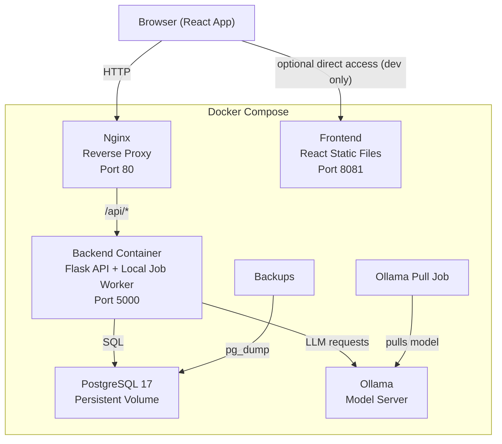
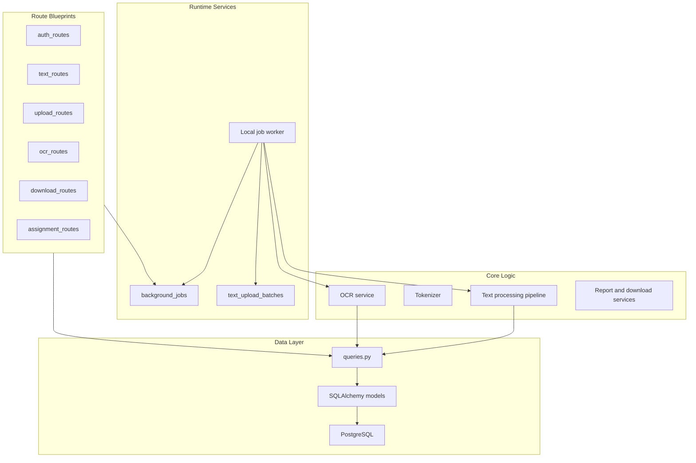
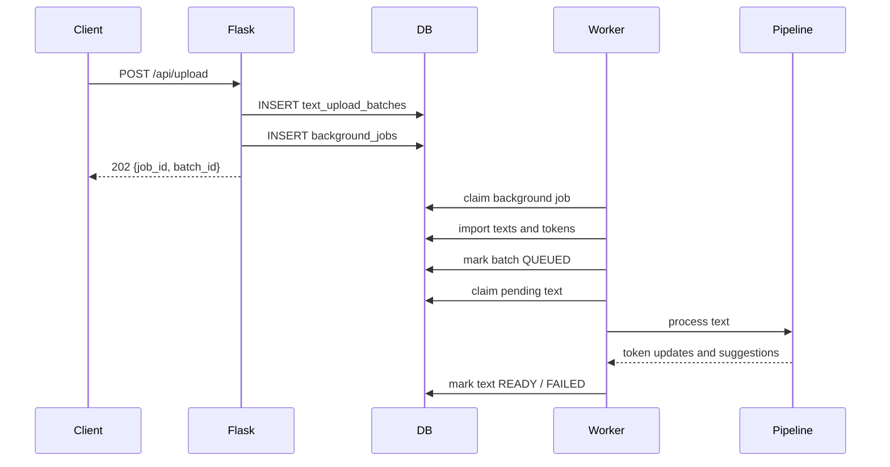

# Backend Architecture

This document describes the high-level backend architecture of Corcel Platform after the move to Postgres-backed asynchronous jobs.

---

## System Overview

Corcel Platform is a Flask application for:

- serving the REST API consumed by the React frontend
- tokenizing and processing Brazilian Portuguese texts
- running OCR over uploaded image archives
- handling asynchronous archive imports and OCR jobs with durable Postgres state
- storing application data in PostgreSQL

---

## Service Topology

In production, the platform runs as Docker Compose services:


```mermaid
graph TB
    Client["Browser (React App)"]

    subgraph Docker ["Docker Compose"]
        Nginx["Nginx<br/>Reverse Proxy<br/>Port 80"]
        Frontend["Frontend<br/>React Static Files<br/>Port 8081"]
        Backend["Backend Container<br/>Flask API + Local Job Worker<br/>Port 5000"]
        DB["PostgreSQL 17<br/>Persistent Volume"]
        Ollama["Ollama<br/>Model Server"]
        OllamaPull["Ollama Pull Job"]
        Backups["Backups"]
    end

    Client -->|HTTP| Nginx
    Nginx -->|"/api/*"| Backend
    Client -->|"optional direct access (dev only)"| Frontend
    Backend -->|SQL| DB
    Backend -->|LLM requests| Ollama
    OllamaPull -->|pulls model| Ollama
    Backups -->|pg_dump| DB
```

The backend container starts the local background-job worker and the Flask API from the same image. There is no Redis broker and no separate Celery worker service.

---

## Internal Architecture


```mermaid
graph TD
    subgraph Routes ["Route Blueprints"]
        Auth["auth_routes"]
        Text["text_routes"]
        Upload["upload_routes"]
        OCR["ocr_routes"]
        Download["download_routes"]
        Assignment["assignment_routes"]
    end

    subgraph Runtime ["Runtime Services"]
        Worker["Local job worker"]
        Jobs["background_jobs"]
        Batches["text_upload_batches"]
    end

    subgraph Core ["Core Logic"]
        Pipeline["Text processing pipeline"]
        Tokenizer["Tokenizer"]
        OCRService["OCR service"]
        Reports["Report and download services"]
    end

    subgraph Data ["Data Layer"]
        Queries["queries.py"]
        Models["SQLAlchemy models"]
        DB2["PostgreSQL"]
    end

    Routes --> Queries
    Routes --> Jobs
    Worker --> Jobs
    Worker --> Batches
    Worker --> Pipeline
    Worker --> OCRService
    Pipeline --> Queries
    OCRService --> Queries
    Queries --> Models
    Models --> DB2
```

---

## Runtime Model

### Request path

- Flask accepts uploads and API requests.
- Upload routes persist a durable job row in `background_jobs`.
- Text upload also creates a durable `text_upload_batches` row.

### Worker path

- `run_jobs.py` starts a local worker loop inside the backend container.
- The worker claims import/OCR jobs from Postgres.
- The worker also claims `PENDING` texts directly from Postgres for NLP processing.
- Reconciliation runs on startup and on an interval to recover interrupted text processing.

### Durability

- Job progress lives in `background_jobs`.
- Long-running text-processing progress lives in `text_upload_batches` and `texts.processing_status`.
- Restart recovery is database-driven instead of broker-driven.

---

## Directory Structure

```text
api/
├── app/
│   ├── app.py
│   ├── background_jobs.py
│   ├── config.py
│   ├── extensions.py
│   ├── job_worker.py
│   ├── logging_config.py
│   ├── routes/
│   ├── schemas/
│   ├── tasks/
│   │   ├── ocr_task_logic.py
│   │   ├── text_task_logic.py
│   │   └── text_upload_task_logic.py
│   ├── text_upload_batches.py
│   └── database/
├── docs/
├── logs/
├── temp_uploads/
├── tests/
├── run_api.py
├── run_jobs.py
└── start.sh
```

---

## Application Factory

`create_app()` builds the Flask application, initializes shared extensions, configures request logging, registers blueprints, and optionally runs additive schema bootstrap.

The shared extensions now include:

- `db`
- `jwt`
- `bcrypt`
- `limiter`

There is no Celery extension wiring in the Flask app.

---

## Asynchronous Processing


```mermaid
sequenceDiagram
    participant Client
    participant Flask
    participant DB
    participant Worker
    participant Pipeline

    Client->>Flask: POST /api/upload
    Flask->>DB: INSERT text_upload_batches
    Flask->>DB: INSERT background_jobs
    Flask-->>Client: 202 {job_id, batch_id}

    Worker->>DB: claim background job
    Worker->>DB: import texts and tokens
    Worker->>DB: mark batch QUEUED

    Worker->>DB: claim pending text
    Worker->>Pipeline: process text
    Pipeline-->>Worker: token updates and suggestions
    Worker->>DB: mark text READY / FAILED
```

The same model is used for OCR uploads, except the worker executes the OCR pipeline and writes `RawText` rows instead of processed texts.

---

## Technology Stack

| Layer | Technology | Purpose |
|---|---|---|
| Web framework | Flask 3.1 | REST API |
| Authentication | Flask-JWT-Extended | JWT cookies |
| Password hashing | Flask-Bcrypt | Password storage |
| ORM | SQLAlchemy + Flask-SQLAlchemy | Persistence |
| Database | PostgreSQL 17 | Durable state |
| Validation | Pydantic + flask-pydantic | Request/response validation |
| Async runtime | Local DB worker + Postgres job rows | Durable asynchronous processing |
| NLP tokenizer | spaCy + spacy-udpipe | Portuguese tokenization |
| Spell checking | Hunspell + pyspellchecker | Variant detection |
| Suggestions | PyTorch + Transformers | Candidate generation |
| OCR | Google Gemini | Image-to-text extraction |
| Containerization | Docker + Docker Compose | Deployment |
| Reverse proxy | Nginx | Routing and static assets |

---

## Related Documents

- [API Reference](api-reference.md)
- [Async Jobs](async-tasks.md)
- [Database Schema](database.md)
- [Authentication](authentication.md)
