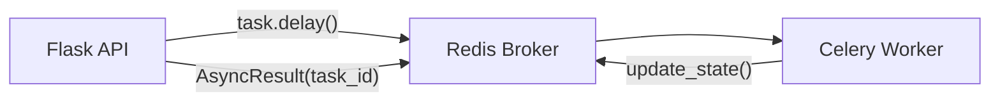
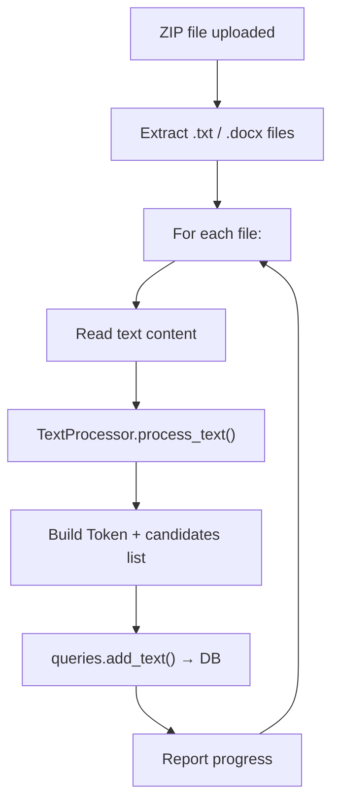
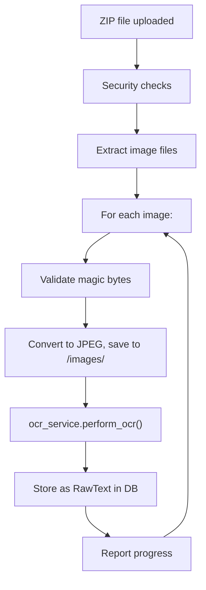

# Asynchronous Tasks

This document describes the Celery-based task system used for long-running operations: text file processing and OCR. It also explains how to customize the text processing and OCR modules for your own use case.

Source files: [tasks.py](../app/tasks.py) · [text_processor.py](../app/text_processor.py) · [tokenizer.py](../app/tokenizer.py) · [ocr_service.py](../app/services/ocr_service.py) · [run_worker.py](../run_worker.py) · [start.sh](../start.sh)

---

## Overview

Two operations are too expensive to run in a request-response cycle and are offloaded to a Celery worker:

| Task | Trigger | What It Does |
|---|---|---|
| `process_zip_texts` | `POST /api/upload` | Extracts `.txt`/`.docx` files from a ZIP, runs full NLP (tokenization + spell check + suggestions), and inserts processed texts into the database |
| `process_ocr_zip` | `POST /api/ocr/upload` | Extracts images from a ZIP, runs OCR via Google Gemini, and stores the results as raw texts for manual review |

Both tasks report progress that can be polled via `GET /api/status/<task_id>`.

> [!IMPORTANT]
> This project now uses **standard Celery terminal semantics**:
> - Successful jobs complete as `SUCCESS`.
> - Failures raise exceptions and complete as `FAILURE`.
> - Error objects are no longer returned as successful payloads.

---

## Infrastructure



| Component | Configuration |
|---|---|
| **Broker** | Redis (started inside the backend container by [start.sh](../start.sh)) |
| **Worker pool** | `--pool=solo` (single-threaded, required to avoid CUDA fork issues with PyTorch) |
| **Concurrency** | 1 worker process |

The worker is started alongside the API in the same container:

```bash
# From start.sh
redis-server --daemonize yes
celery -A run_worker worker --pool=solo --loglevel=info &
flask run --host=0.0.0.0 --port=5000
```

---

## Task 1: `process_zip_texts`

Processes uploaded text documents through the full NLP pipeline and inserts them directly into the `texts` and `tokens` tables.

### Pipeline



### Step-by-Step

1. **Extract** — The ZIP is opened and filtered for `.txt` and `.docx` files (hidden files and `__MACOSX` are skipped).
2. **Read** — `.docx` files are parsed with `python-docx`; `.txt` files are decoded as UTF-8.
3. **Process** — Each file's text is passed to `TextProcessor.process_text()`, which returns tokenized data with spell-check results and ranked suggestions (see [Output Structure](#textprocessorprocess_text-output) below).
4. **Store** — For each token, a `Token` model is created and paired with its suggestion candidates. The entire batch is inserted via `queries.add_text()`.
5. **Progress** — After each file, the task calls `self.update_state()` with the current progress.

### Return Value

```json
{
    "status": "Concluido",
  "total": 10,
  "result": {
    "essay_001.txt": { "text_id": 42, "token_count": 350 },
    "essay_002.docx": { "text_id": 43, "token_count": 280 }
    },
    "failed_files": []
}
```

On failure, the task raises an exception and transitions to `FAILURE`. The status endpoint returns the failure message under `error`.

### Implementation Notes

- ZIP path entries are normalized to base filenames (`os.path.basename(...)`) before processing and persistence.
- Temporary ZIP files are cleaned up in a `finally` block, regardless of success or failure.
- Recommended operational behavior: treat `FAILURE` as a terminal state and avoid retry storms without root-cause classification.

---

## Task 2: `process_ocr_zip`

Processes uploaded images through OCR and stores the results as **raw texts** (not processed texts). Raw texts must be manually reviewed and finalized by a user before entering the main pipeline.

### Pipeline



### Security Checks

OCR validation is applied in two layers:

| Layer | Check | Limit |
|---|---|---|
| Upload route (`POST /api/ocr/upload`) | Uploaded ZIP file size | 500 MB max |
| Celery task (`process_ocr_zip`) | Uncompressed ZIP content size | 1000 MB max |

| Check | Limit |
|---|---|
| Uncompressed size | 1000 MB max |
| Image dimensions | 20,000 × 20,000 px max |
| Pixel count | ~89M pixels max (PIL default) |
| Path traversal | Filenames with `..` are rejected |
| Magic bytes | Only PNG, JPEG, and TIFF headers accepted |

Further checks can (and maybe should) be added in the future to improve security and performance.

### Step-by-Step

1. **Validate ZIP** — Check total uncompressed size against the limit.
2. **Filter** — Keep only files ending in `.png`, `.jpg`, `.jpeg`, `.tif`, `.tiff`.
3. **Validate image** — Check magic bytes to verify the file is actually an image.
4. **Convert** — Open with PIL, convert to RGB, save as JPEG (quality 85) to the `images/` directory with a UUID prefix.
5. **OCR** — Call `ocr_service.perform_ocr(image_path)` to extract text via Google Gemini.
6. **Store** — Insert a `RawText` record with the extracted text and the path to the saved image.

If any file fails validation or OCR processing, the task raises and ends as `FAILURE`.

### Return Value

```json
{
  "status": "Concluido",
  "total": 5,
  "result": {
        "page_01.png": { "text_content": "...", "image_path": "uuid_page_01.jpg" }
    },
    "failed_files": []
}
```

### Persistence Behavior

- Only successful runs persist OCR results to the database.
- On task failure, no partial OCR result set is inserted by the final DB write step.

### Filename Handling

- Input ZIP entries are normalized to basename keys in task results.
- Stored image files are renamed to UUID-prefixed JPEG filenames under `images/`.
- RawText records store the normalized source filename and stored image path.

---

## Customizing the Text Processing Module

The `process_zip_texts` task relies on `TextProcessor.process_text()` to convert raw text into tokens with suggestion candidates. You can replace or modify this module to use a different NLP pipeline (e.g., a different language, a different model, or no model at all).

### `TextProcessor.process_text()` Output

The method must return a **dictionary** where:
- **Keys** are integer position indices (0-based)
- **Values** are token dictionaries with the following structure:

```python
{
    0: {
        "idx": 0,              # int — same as the key
        "text": "Hello",       # str — the token string
        "is_word": True,       # bool — True if alphabetic, False for punctuation/numbers
        "to_be_normalized": False,  # bool — whether the token should be flagged for correction
        "suggestions": ["Hallo", "Help"],  # list[str] — ranked correction candidates
        "whitespace_after": " "    # str — whitespace character(s) following this token ("" if none).
    },
    1: {
        "idx": 1,
        "text": ",",
        "is_word": False,
        "to_be_normalized": False,
        "suggestions": [],
        "whitespace_after": " "
    },
    # ... one entry per token
}
```
> Note: If your tokenizer does not provide a `whitespace_after` field, you can use a database query to add it after the token is inserted into the database. For example:

```sql
-- This query adds a whitespace after each token that is a word. 
-- It is a naive approach, you may want to improve it.
UPDATE tokens
SET whitespace_after = ' '
WHERE text_id = <text_id>
  AND is_word = TRUE;
```


### Field Reference

| Field | Type | Required | Used For |
|---|---|---|---|
| `idx` | `int` | Yes | Stored as `Token.position` in the database |
| `text` | `str` | Yes | Stored as `Token.token_text` |
| `is_word` | `bool` | Yes | Stored as `Token.is_word`; affects UI rendering |
| `to_be_normalized` | `bool` | Yes | Stored as `Token.to_be_normalized`; flags the token for correction in the UI |
| `suggestions` | `list[str]` | Yes | Each string becomes a `Suggestion` record linked to the token via `TokensSuggestions` |
| `whitespace_after` | `str` | Yes | Stored as `Token.whitespace_after`; used to reconstruct the original text layout |

### How to Replace the Processor

To use your own text processing logic:

1. **Create your processor class** with a `process_text(self, text: str) -> dict` method that returns data in the format above.

2. **Update the import** in [tasks.py](../app/tasks.py):

```diff
-from .text_processor import TextProcessor
+from .my_processor import MyProcessor
```

3. **Update the instantiation** in `process_zip_texts`:

```diff
-processor = TextProcessor()
+processor = MyProcessor()
```

### Minimal Example

Here's the simplest possible processor that tokenizes text by whitespace with no suggestions:

```python
class SimpleProcessor:
    def process_text(self, text: str) -> dict:
        results = {}
        for i, word in enumerate(text.split()):
            results[i] = {
                "idx": i,
                "text": word,
                "is_word": word.isalpha(),
                "to_be_normalized": False,
                "suggestions": [],
                "whitespace_after": " "
            }
        return results
```

> This would work, but all tokens would be marked as correct with no suggestions. The value comes from implementing spell checking in your processor.

### Current Implementation: Pipeline Overview

The built-in `TextProcessor` (which extends `Tokenizer`) uses a multi-stage pipeline:

1. **Tokenization** — spaCy Portuguese model splits text into tokens
2. **Spell Check** — Hunspell + pyspellchecker generate correction candidates
3. **False Positive Filtering** — BERTimbau checks if "misspelled" words are actually valid in context (e.g., proper nouns)
4. **Context-Aware Ranking** — BERTimbau ranks candidates by contextual probability using masked language modeling

For a full explanation of the NLP pipeline stages, refer to the implementation in [text_processor.py](../app/text_processor.py) and [tokenizer.py](../app/tokenizer.py).

---

## Customizing the OCR Module

The `process_ocr_zip` task calls `ocr_service.perform_ocr()` for each image. You can replace this with any OCR engine.

### `perform_ocr()` Interface

The function must accept an image path and return a string:

```python
def perform_ocr(image_path: str) -> str:
    """
    Extract text from an image file.

    Args:
        image_path: Absolute path to a JPEG image file.

    Returns:
        The extracted text as a plain string.
    """
```

### How to Replace the OCR Service

1. **Create your OCR module** (e.g., `my_ocr_service.py`) with a `perform_ocr(image_path: str) -> str` function.

2. **Update the import** in [tasks.py](../app/tasks.py):

```diff
-from .services import ocr_service
+from .services import my_ocr_service as ocr_service
```

### Example: Using Tesseract Instead of Google Gemini

```python
# app/services/my_ocr_service.py
import pytesseract
from PIL import Image

def perform_ocr(image_path: str) -> str:
    image = Image.open(image_path)
    text = pytesseract.image_to_string(image, lang='por')
    return text
```

### Current Implementation

The built-in implementation in [ocr_service.py](../app/services/ocr_service.py) uses the Google Gemini API (`google-genai` SDK) with model `gemini-flash-lite-latest`. It:

1. Loads the image from disk
2. Sends it to Gemini with a prompt requesting accurate transcription
3. Returns the extracted text as a string

This requires the `API_KEY` environment variable to be set.

---

## Text Formatting

Before raw texts (from OCR) are stored in the database, the `format_text_content()` helper in [tasks.py](../app/tasks.py) applies formatting:

- Single line breaks (`\n`) are replaced with a space
- Double line breaks (`\n\n`) are replaced with `\n\t` (newline + tab)

This is applied **only once**, during initial insertion. It normalizes paragraph structure in OCR output, which tends to have inconsistent line breaks.

---

## Progress Reporting

Both tasks report progress via Celery's `update_state()` mechanism. The frontend polls `GET /api/status/<task_id>` to get the current state:

| State | Meaning | Meta Fields |
|---|---|---|
| `PENDING` | Task is queued | — |
| `PROGRESS` | Task is running | `current`, `total`, `status` |
| `SUCCESS` | Task completed | `result`, `failed_files` |
| `FAILURE` | Task failed | `error` |

Recommended client handling:

1. Treat `SUCCESS` and `FAILURE` as terminal states.
2. Use `error` from `FAILURE` for user-visible diagnostics.
3. Avoid assuming partial success payloads for failed tasks.
