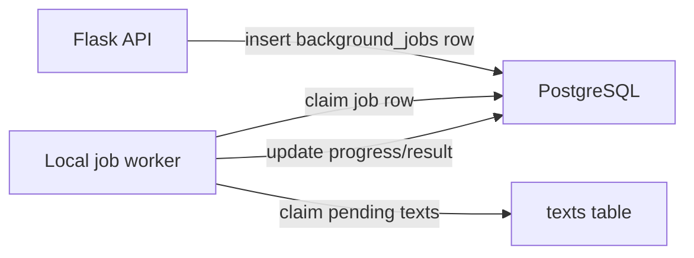
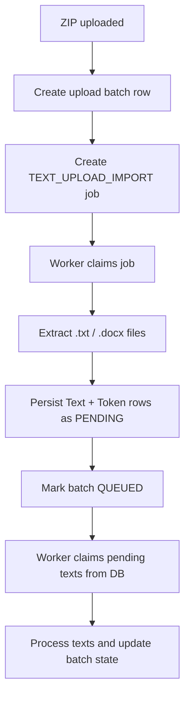
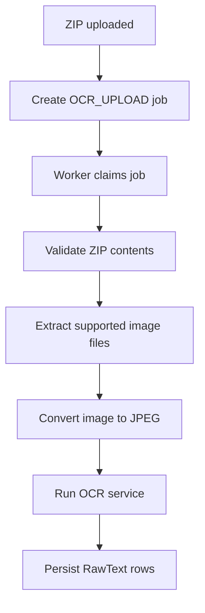

# Asynchronous Jobs

This document describes the Postgres-backed asynchronous job system used for long-running operations: text upload import and OCR archive processing.

Source files: [background_jobs.py](../app/background_jobs.py) · [job_worker.py](../app/job_worker.py) · [text_upload_task_logic.py](../app/tasks/text_upload_task_logic.py) · [text_task_logic.py](../app/tasks/text_task_logic.py) · [ocr_task_logic.py](../app/tasks/ocr_task_logic.py) · [text_upload_batches.py](../app/text_upload_batches.py) · [run_jobs.py](../run_jobs.py) · [start.sh](../start.sh)

---

## Overview

Two operations are intentionally handled outside the request-response cycle:

| Job Kind | Trigger | What It Does |
|---|---|---|
| `TEXT_UPLOAD_IMPORT` | `POST /api/upload` | Imports `.txt` and `.docx` files from a ZIP into durable `Text` and `Token` rows, then lets the worker process imported texts directly from Postgres |
| `OCR_UPLOAD` | `POST /api/ocr/upload` | Extracts images from a ZIP, runs OCR via Google Gemini, and stores the results as raw texts for manual review |

Job progress is durable in Postgres and can be polled via `GET /api/status/<job_id>`.

---

## Infrastructure


```mermaid
flowchart LR
    A["Flask API"] -->|"insert background_jobs row"| B["PostgreSQL"]
    C["Local job worker"] -->|"claim job row"| B
    C -->|"update progress/result"| B
    C -->|"claim pending texts"| D["texts table"]
```

The backend container starts:

```bash
# From start.sh
uv run python run_jobs.py &
uv run python run_api.py
```

There is no external broker. Postgres stores:

- background job progress
- upload batch state
- per-text processing state
- restart recovery signals

---

## Job 1: `TEXT_UPLOAD_IMPORT`

Processes uploaded text archives asynchronously after the API route persists the archive and returns `job_id` plus `batch_id`.

### Lifecycle

1. Create a durable `text_upload_batches` row.
2. Save the uploaded ZIP to the backend spool directory.
3. Create a `background_jobs` row with kind `TEXT_UPLOAD_IMPORT`.
4. The local worker claims the job, imports `.txt` and `.docx` files, and persists `Text` plus `Token` rows as `PENDING`.
5. The worker marks the batch `QUEUED`.
6. The same worker loop later claims `PENDING` texts directly from Postgres and processes them to `READY` or `FAILED`.
7. The frontend uses `batch_id` for durable progress and restart recovery after the short-lived import job completes.

### Import Pipeline


```mermaid
flowchart TD
    A["ZIP uploaded"] --> B["Create upload batch row"]
    B --> C["Create TEXT_UPLOAD_IMPORT job"]
    C --> D["Worker claims job"]
    D --> E["Extract .txt / .docx files"]
    E --> F["Persist Text + Token rows as PENDING"]
    F --> G["Mark batch QUEUED"]
    G --> H["Worker claims pending texts from DB"]
    H --> I["Process texts and update batch state"]
```

### Result Shape

```json
{
  "state": "SUCCESS",
  "status": "Finished",
  "result": {
    "kind": "text_upload",
    "batch_id": 7,
    "text_ids": [42, 43],
    "created": 2,
    "failed_files": []
  },
  "failed_files": []
}
```

### Operational Notes

- `job_id` only tracks archive import progress.
- `batch_id` is the durable source of truth for long-running text processing.
- Imported texts remain `PENDING` until the worker claims them for NLP processing.
- Recovery is DB-driven. If the worker restarts, stale `PROCESSING` texts are reset and reclaimed from Postgres.

---

## Job 2: `OCR_UPLOAD`

Processes uploaded image archives asynchronously and stores the results as raw texts.

### Lifecycle

1. Save the uploaded ZIP to the backend spool directory.
2. Create a `background_jobs` row with kind `OCR_UPLOAD`.
3. The local worker claims the job.
4. The OCR pipeline extracts valid images, converts them to JPEG, runs OCR, and persists `RawText` rows.
5. The job finishes as `SUCCESS` or `FAILURE`.

### OCR Pipeline


```mermaid
flowchart TD
    A["ZIP uploaded"] --> B["Create OCR_UPLOAD job"]
    B --> C["Worker claims job"]
    C --> D["Validate ZIP contents"]
    D --> E["Extract supported image files"]
    E --> F["Convert image to JPEG"]
    F --> G["Run OCR service"]
    G --> H["Persist RawText rows"]
```

### Result Shape

```json
{
  "state": "SUCCESS",
  "status": "Finished",
  "result": {
    "page_01.png": {
      "text_content": "...",
      "image_path": "uuid_page_01.jpg"
    }
  },
  "failed_files": []
}
```

---

## Status Polling

`GET /api/status/<job_id>` reads directly from the `background_jobs` table.

| State | Meaning | Fields |
|---|---|---|
| `PENDING` | Job exists but has not been claimed yet | `status` |
| `RUNNING` | Worker claimed the job and is updating progress | `status`, `current`, `total` |
| `SUCCESS` | Job completed successfully | `result`, `failed_files` |
| `FAILURE` | Job failed | `error`, `failed_files` |

Recommended client behavior:

1. Treat `SUCCESS` and `FAILURE` as terminal states.
2. Use `batch_id` endpoints for durable text-processing progress after text import finishes.
3. Do not assume OCR and text import jobs share the same result payload shape beyond the common job envelope.

---

## Restart Recovery

The local worker runs reconciliation on startup and on a fixed interval:

- stale `PROCESSING` texts are reset back to `PENDING`
- batches are recomputed from durable child text state
- pending text work is reclaimed directly from Postgres

This design removes broker dependency from correctness and keeps upload recovery durable across process and container restarts.
