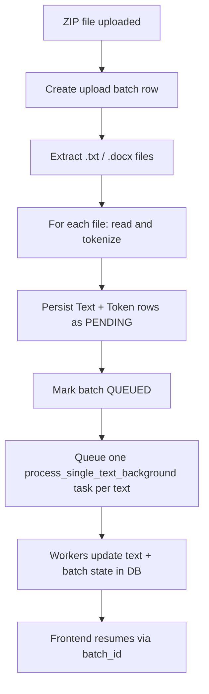
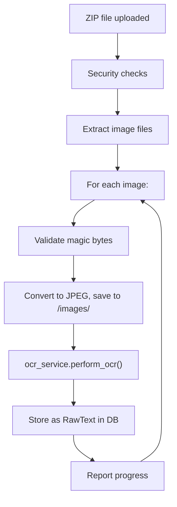

# Asynchronous Tasks

This document describes the Celery-based task system used for long-running operations: text file processing and OCR. It also explains how to customize the OCR module for your own use case.

Source files: [celery_tasks.py](../app/tasks/celery_tasks.py) · [text_upload_task_logic.py](../app/tasks/text_upload_task_logic.py) · [text_task_logic.py](../app/tasks/text_task_logic.py) · [text_upload_batches.py](../app/text_upload_batches.py) · [run_worker.py](../run_worker.py) · [start.sh](../start.sh)

---

## Overview

Two operations are too expensive to run in a request-response cycle and are offloaded to a Celery worker:

| Task | Trigger | What It Does |
|---|---|---|
| `process_text_upload_zip` | `POST /api/upload` | Creates a durable upload batch, imports `.txt`/`.docx` files into the database, and fans out one background NLP task per imported text |
| `process_ocr_zip` | `POST /api/ocr/upload` | Extracts images from a ZIP, runs OCR via Google Gemini, and stores the results as raw texts for manual review |

Both tasks report progress that can be polled via `GET /api/status/<task_id>`.

> [!IMPORTANT]
> This project now uses **standard Celery terminal semantics**:
> - Successful jobs complete as `SUCCESS`.
> - Failures raise exceptions and complete as `FAILURE`.
> - Error objects are no longer returned as successful payloads.

---

## Infrastructure


```mermaid
flowchart LR
    A["Flask API"] -- "task.delay()" --> B["Redis Broker"]
    B --> C["Celery Worker"]
    C -- "update_state()" --> B
    A -- "AsyncResult(task_id)" --> B
```

| Component | Configuration |
|---|---|
| **Broker** | Redis (started inside the backend container by [start.sh](../start.sh)) |
| **Worker pool** | `--pool=solo` (single-threaded, required to avoid CUDA fork issues with PyTorch) |
| **Concurrency** | 1 worker process |

The worker is started alongside the API in the same container:

```bash
# From start.sh
redis-server --daemonize yes
celery -A run_worker worker --pool=solo --loglevel=info &
flask run --host=0.0.0.0 --port=5000
```

---

## Task 1: `process_text_upload_zip`

Processes uploaded text documents asynchronously after the API route has already accepted the upload and returned a `task_id` plus `batch_id`.

Current behavior:

1. Create a durable `text_upload_batches` row before import starts.
2. Import the `.txt` / `.docx` files and persist `Text` + `Token` rows immediately with `processing_status=PENDING`.
3. Record imported texts under `upload_batch_id` and queue one `process_single_text_background(text_id)` task per imported text.
4. Treat upload-task `SUCCESS` as "import completed and background processing was queued", not "all texts finished NLP processing".
5. Use `GET /api/text-upload-batches/<batch_id>` as the durable source of truth for resume/recovery after the short-lived Celery import task finishes or disappears.

### Pipeline


```mermaid
flowchart TD
    A["ZIP file uploaded"] --> B["Create upload batch row"]
    B --> C["Extract .txt / .docx files"]
    C --> D["For each file: read and tokenize"]
    D --> E["Persist Text + Token rows as PENDING"]
    E --> F["Mark batch QUEUED"]
    F --> G["Queue one process_single_text_background task per text"]
    G --> H["Workers update text + batch state in DB"]
    H --> I["Frontend resumes via batch_id"]
```

### Step-by-Step

1. **Extract** - The ZIP is opened and filtered for `.txt` and `.docx` files (hidden files and `__MACOSX` are skipped).
2. **Read** - `.docx` files are parsed with `python-docx`; `.txt` files are decoded as UTF-8.
3. **Tokenize** - Each file is tokenized immediately during import so the database contains durable `Text` + `Token` rows before NLP processing begins.
4. **Store** - For each token, a `Token` model is created and inserted through `queries.add_text()`, and the created text is linked to the upload batch.
5. **Queue** - After import completes, the batch is marked `QUEUED` and one Celery task is enqueued for each imported text.
6. **Recover** - Batch/text state lives in Postgres, and stale `PENDING` / `PROCESSING` work is re-enqueued by periodic reconciliation rather than relying on Redis task metadata.

> [!NOTE]
> For a user-facing explanation of text processing behavior (tokenization, suggestions, correction workflow, and outputs), see [Text Processing Pipeline](text-processing-pipeline.md).

### Return Value

```json
{
  "status": "Completed",
  "total": 10,
  "result": {
    "kind": "text_upload",
    "batch_id": 7,
    "text_ids": [42, 43],
    "created": 2,
    "failed_files": []
  },
  "failed_files": []
}
```

On failure, the task raises an exception and transitions to `FAILURE`. The status endpoint returns the failure message under `error`.

### Implementation Notes

- ZIP entries are normalized to base filenames (`os.path.basename(...)`) before persistence.
- The import route returns both `task_id` and `batch_id`; `task_id` is for short-lived import progress only.
- Durable progress, restart recovery, and resumed UI tracking must read from the batch endpoints and per-text DB state, not from Redis task metadata.
- Text processing is idempotent per text: generated suggestions and `to_be_normalized` flags are recomputed on retry.

---

## Task 2: `process_ocr_zip`

Processes uploaded images through OCR and stores the results as **raw texts** (not processed texts). Raw texts must be manually reviewed and finalized by a user before entering the main pipeline.

### Pipeline


```mermaid
flowchart TD
    A["ZIP file uploaded"] --> B["Security checks"]
    B --> C["Extract image files"]
    C --> D["For each image:"]
    D --> E["Validate magic bytes"]
    E --> F["Convert to JPEG, save to /images/"]
    F --> G["ocr_service.perform_ocr()"]
    G --> H["Store as RawText in DB"]
    H --> I["Report progress"]
    I --> D
```

### Security Checks

OCR validation is applied in two layers:

| Layer | Check | Limit |
|---|---|---|
| Upload route (`POST /api/ocr/upload`) | Uploaded ZIP file size | 500 MB max |
| Celery task (`process_ocr_zip`) | Uncompressed ZIP content size | 1000 MB max |

| Check | Limit |
|---|---|
| Uncompressed size | 1000 MB max |
| Image dimensions | 20,000 × 20,000 px max |
| Pixel count | ~89M pixels max (PIL default) |
| Path traversal | Filenames with `..` are rejected |
| Magic bytes | Only PNG, JPEG, and TIFF headers accepted |

Further checks can (and maybe should) be added in the future to improve security and performance.

### Step-by-Step

1. **Validate ZIP** - Check total uncompressed size against the limit.
2. **Filter** - Keep only files ending in `.png`, `.jpg`, `.jpeg`, `.tif`, `.tiff`.
3. **Validate image** - Check magic bytes to verify the file is actually an image.
4. **Convert** - Open with PIL, convert to RGB, save as JPEG (quality 85) to the `images/` directory with a UUID prefix.
5. **OCR** - Call `ocr_service.perform_ocr(image_path)` to extract text via Google Gemini.
6. **Store** - Insert a `RawText` record with the extracted text and the path to the saved image.

If any file fails validation or OCR processing, the task raises and ends as `FAILURE`.

### Return Value

```json
{
  "status": "Completed",
  "total": 5,
  "result": {
        "page_01.png": { "text_content": "...", "image_path": "uuid_page_01.jpg" }
    },
    "failed_files": []
}
```

### Persistence Behavior

- Only successful runs persist OCR results to the database.
- On task failure, no partial OCR result set is inserted by the final DB write step.

### Filename Handling

- Input ZIP entries are normalized to basename keys in task results.
- Stored image files are renamed to UUID-prefixed JPEG filenames under `images/`.
- RawText records store the normalized source filename and stored image path.

## Customizing the OCR Module

The `process_ocr_zip` task calls `ocr_service.perform_ocr()` for each image. You can replace this with any OCR engine.

### `perform_ocr()` Interface

The function must accept an image path and return a string:

```python
def perform_ocr(image_path: str) -> str:
    """
    Extract text from an image file.

    Args:
        image_path: Absolute path to a JPEG image file.

    Returns:
        The extracted text as a plain string.
    """
```

### How to Replace the OCR Service

1. **Create your OCR module** (e.g., `my_ocr_service.py`) with a `perform_ocr(image_path: str) -> str` function.

2. **Update the import** in [ocr_task_logic.py](../app/tasks/ocr_task_logic.py):

```diff
-from .services import ocr_service
+from .services import my_ocr_service as ocr_service
```

### Example: Using Tesseract Instead of Google Gemini

```python
# app/services/my_ocr_service.py
import pytesseract
from PIL import Image

def perform_ocr(image_path: str) -> str:
    image = Image.open(image_path)
    text = pytesseract.image_to_string(image, lang='por')
    return text
```

### Current Implementation

The built-in implementation in [ocr_service.py](../app/services/ocr_service.py) uses the Google Gemini API (`google-genai` SDK) with model `gemini-flash-lite-latest`. It:

1. Loads the image from disk
2. Sends it to Gemini with a prompt requesting accurate transcription
3. Returns the extracted text as a string

This requires the `API_KEY` environment variable to be set.

---

## Text Formatting

Before raw texts (from OCR) are stored in the database, the `format_text_content()` helper in [text_formatting.py](../app/tasks/text_formatting.py) applies formatting:

- Single line breaks (`\n`) are replaced with a space
- Double line breaks (`\n\n`) are replaced with `\n\t` (newline + tab)

This is applied **only once**, during initial insertion. It normalizes paragraph structure in OCR output, which tends to have inconsistent line breaks.

---

## Progress Reporting

Both tasks report progress via Celery's `update_state()` mechanism. The authenticated frontend polls `GET /api/status/<task_id>` to get the current state:

| State | Meaning | Meta Fields |
|---|---|---|
| `PENDING` | Task is queued | - |
| `PROGRESS` | Task is running | `current`, `total`, `status` |
| `SUCCESS` | Task completed | `result`, `failed_files` |
| `FAILURE` | Task failed | `error` |

Recommended client handling:

1. Treat `SUCCESS` and `FAILURE` as terminal states.
2. Use `error` from `FAILURE` for user-visible diagnostics.
3. Avoid assuming partial success payloads for failed tasks.
