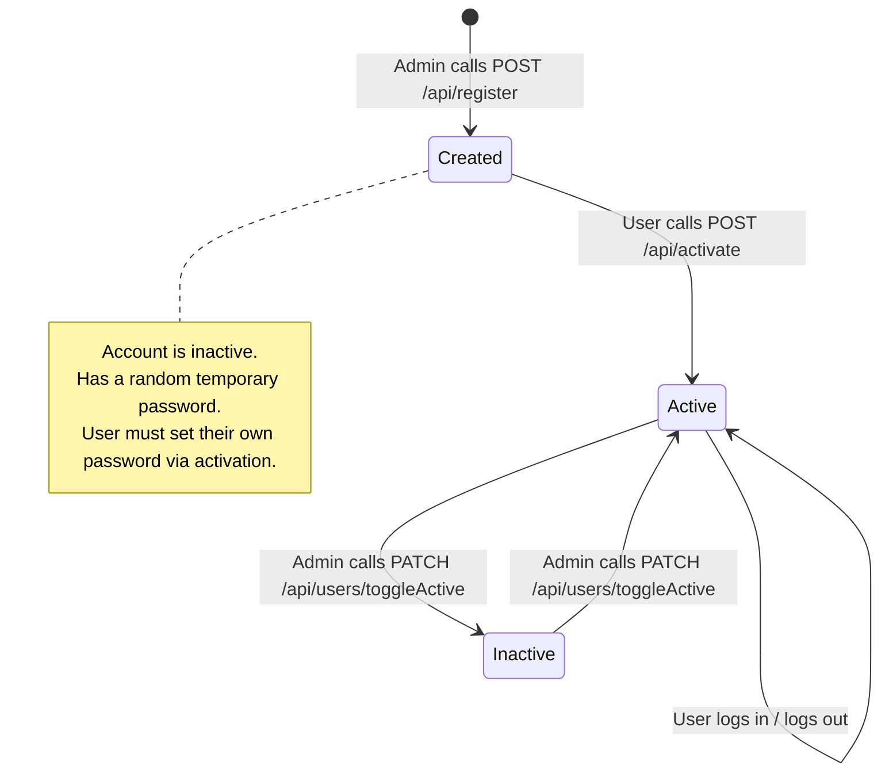
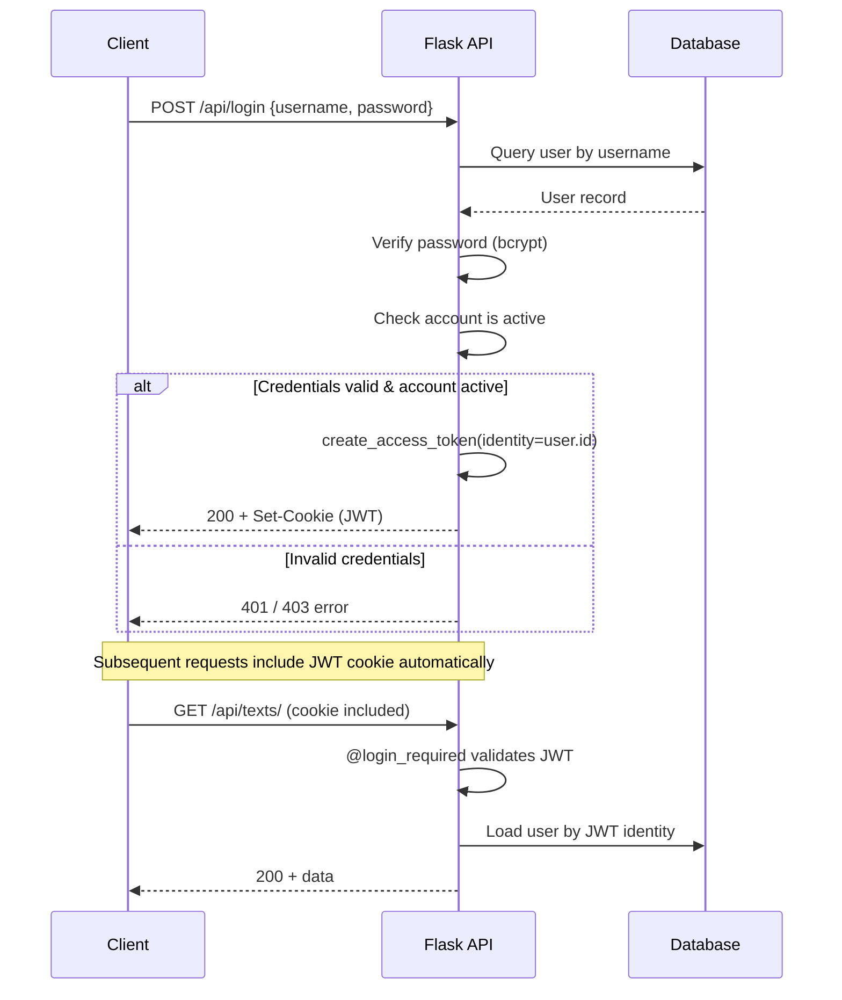

# Authentication & Authorization

This document describes how the Corcel Platform authenticates users, manages sessions, and enforces role-based access control.

Source files: [auth_routes.py](../app/routes/auth_routes.py) · [decorators.py](../app/utils/decorators.py) · [extensions.py](../app/extensions.py) · [config.py](../app/config.py)

---

## Overview

The platform uses **JWT (JSON Web Tokens)** stored in **HTTP-only cookies** for stateless authentication. Passwords are hashed with **bcrypt**. Access control is enforced via two custom decorators: `@login_required` and `@admin_required`.

Key libraries:
- [Flask-JWT-Extended](https://flask-jwt-extended.readthedocs.io/) — JWT creation, validation, and cookie management
- [Flask-Bcrypt](https://flask-bcrypt.readthedocs.io/) — password hashing

---

## User Lifecycle



1. **Registration** — An admin creates a new user via `POST /api/register`. The account is created as **inactive** with a random temporary password.
2. **Activation** — The new user calls `POST /api/activate` with their username and chosen password. This sets the real password and marks the account as active.
3. **Login** — The user authenticates via `POST /api/login`. On success, a JWT access token is set as an HTTP-only cookie.
4. **Deactivation** — An admin can toggle a user's active status via `PATCH /api/users/toggleActive`. This also serves as a password reset mechanism — deactivating a user forces them to re-activate with a new password.
5. TODO: Add user deletion with all associated data.

---

## Authentication Flow



### JWT Configuration

The JWT behavior is controlled by these environment variables (set in `.env`):

| Variable | Purpose | Default |
|---|---|---|
| `JWT_SECRET_KEY` | Secret key for signing tokens | (required) |
| `JWT_TOKEN_LOCATION` | Where to look for the token | `cookies` |
| `JWT_COOKIE_SAMESITE` | SameSite cookie attribute | `None` |
| `JWT_COOKIE_SECURE` | Require HTTPS for cookies | `True` |
| `JWT_ACCESS_TOKEN_EXPIRES` | Token lifetime | `24 hours` |

> The `isAdmin` field in the login response should **only** be used by the frontend for conditionally showing admin-only UI elements. It is **not** used for authorization — the backend always re-validates the user's role from the database on every request.

---

## Password Hashing

Passwords are hashed using bcrypt via [Flask-Bcrypt](../app/extensions.py):

```python
from app.extensions import bcrypt

# Hash a password (done in User.set_password)
hashed = bcrypt.generate_password_hash(password).decode('utf-8')

# Verify a password (done in User.check_password)
bcrypt.check_password_hash(user.hashed_password, password)
```

The `User` model provides convenience methods:
- `user.set_password(password)` — hashes and stores the password
- `user.check_password(password)` — verifies a plaintext password against the stored hash

---

## Route Protection Decorators

Both decorators are defined in [decorators.py](../app/utils/decorators.py). They inject a `current_user` parameter into the route function.

### `@login_required()`

Ensures the request has a valid JWT cookie. If valid, loads the `User` object from the database and passes it as `current_user`.

```python
@text_bp.route('/api/texts/', methods=['GET'])
@login_required()
def get_texts_data(current_user):
    # current_user is a User model instance
    ...
```

**Behavior:**
1. Calls `@jwt_required()` internally to validate the JWT
2. Extracts the user ID from the token identity (`get_jwt_identity()`)
3. Queries the database for the user and verifies they exist and are active
4. If valid, calls the route function with `current_user=user`
5. If invalid, returns a `401` or `403` error

### `@admin_required()`

Extends `@login_required()` by additionally checking that `current_user.is_admin` is `True`.

```python
@auth_bp.route('/api/register', methods=['POST'])
@validate()
@admin_required()
def register(body: UserRegisterRequest, current_user=None):
    # Only admins reach this point
    ...
```

**Behavior:**
1. Performs all steps of `@login_required()`
2. Checks `current_user.is_admin`
3. If not admin, returns `403 Forbidden`

### Decorator Ordering

When combining decorators with `@validate()`, the order matters:

```python
@route(...)          # 1. Flask routing
@validate()          # 2. Pydantic request validation
@admin_required()    # 3. Auth check (runs first at request time)
def handler(body, current_user):
    ...
```

At request time, the execution order is reversed from definition: auth check runs first, then validation, then the handler.

---

## Role-Based Access Control

There are two roles in the system:

| Role | Description | Access Level |
|---|---|---|
| **User** | Regular authenticated user | Can view assigned texts, create normalizations, download reports |
| **Admin** | Elevated privileges | All user abilities + register/deactivate users, upload texts, manage assignments, toggle admin |

### Admin Safeguards

- The system prevents revoking admin privileges from the **last remaining admin** (checked via `count_admin_users()` in `queries.py`)
- Admin status is toggled via `PATCH /api/users/toggleAdmin`

### Access Level Summary

Each one of these permissions can be easily changed by modifying the decorators in the routes.
For example, if you want to allow a user to register a new user, you can change the `@admin_required()` decorator from the `register` route to `@login_required()`. Remove the decorator to allow not authenticated users to use the endpoint (strongly not recommended for most cases).

| Endpoint Group | User 🔒 | Admin 🔑 |
|---|---|---|
| Login / Logout / Activate | ✅ (no auth) | ✅ (no auth) |
| View texts & normalizations | ✅ | ✅ |
| Create / delete normalizations | ✅ | ✅ |
| Download reports & texts | ✅ | ✅ |
| Whitelist management | ✅ | ✅ |
| Register users | ❌ | ✅ |
| Toggle user active/admin | ❌ | ✅ |
| View user data | ❌ | ✅ |
| Upload text files / OCR | ❌ | ✅ |
| Manage assignments | ✅ | ✅ |

---

## Cookie Security

The JWT is stored in an HTTP-only cookie:

| Cookie Attribute | Value | Purpose |
|---|---|---|
| `HttpOnly` | `true` | Prevents JavaScript access |
| `Secure` | `true` (production) | Only sent over HTTPS |
| `SameSite` | `None` | Allows cross-origin requests (required for API/frontend on different origins) |

On logout (`GET /api/logout`), the JWT cookie is cleared via `unset_jwt_cookies()`.

---

## CORS Configuration

Cross-Origin Resource Sharing is enabled via `CORS(app)` in the [application factory](../app/app.py). This allows the frontend (which may be served from a different origin) to make authenticated requests with cookies.
