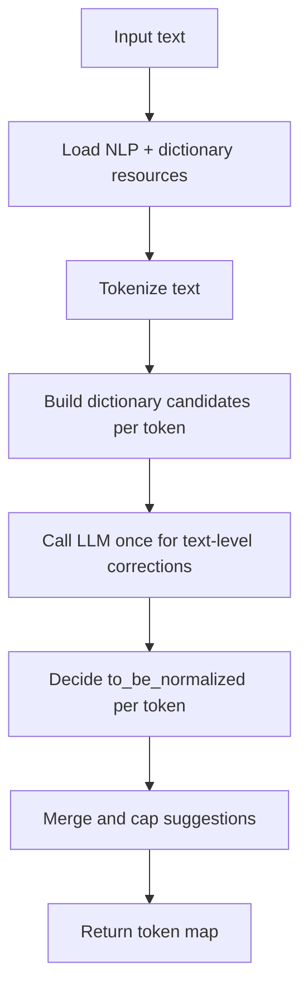

# Text Processing Pipeline

This document explains only the processing pipeline executed by `TextProcessor.process_text()`.

Source files: [text_processor.py](../app/text_processor.py) · [tokenizer.py](../app/tokenizer.py) · [text_task_logic.py](../app/tasks/text_task_logic.py)

---

## Pipeline at a Glance



---

## Step-by-Step Processing

### 1. Load resources (lazy initialization)

When `process_text()` is called, resources are loaded on first use by `Tokenizer._load_resources()`:

1. Load Hunspell dictionary (`.dic` + `.aff`) for Portuguese.
2. Ensure local word list exists (`dicts/br-utf8.txt`), downloading it if missing.
3. Convert dictionary to JSON (`dicts/br-utf8.json`) if missing.
4. Initialize `SpellChecker` using the JSON dictionary.
5. Download and load `spacy-udpipe` Portuguese model (`pt`) and set tokenizer behavior.

Result: three engines are available to the processor: `nlp`, `hobj` (Hunspell), and `spell`.

### 2. Tokenize text

`doc = self.nlp(text)` creates an ordered token stream.

For each token, an initial record is created:

| Field | Description |
|---|---|
| `idx` | Token index in the sequence |
| `text` | Original token string |
| `is_word` | `True` for alphabetic/hyphen-word tokens, else `False` |
| `to_be_normalized` | Initially `False` |
| `suggestions` | Initially empty list |
| `whitespace_after` | Original trailing whitespace after token |

Non-word tokens (punctuation, numbers, symbols) are kept in output but skipped for correction logic.

### 3. Build dictionary candidates per word token

For each word token:

1. Collect candidates from `SpellChecker.candidates(word)`.
2. Collect candidates from `HunSpell.suggest(word)`.
3. Merge into a set and remove the original token.
4. Apply case matching so suggestions preserve source casing (upper/capitalized/lower).

This step produces `token_candidates[index]` for later merge.

### 4. Run one LLM call for the full text

The processor calls Ollama once per text:

1. Build a Portuguese prompt asking for JSON array output with `word` and `suggestions`.
2. Send `POST {OLLAMA_BASE_URL}/api/generate` using model `gemma3:4b`.
3. Parse response into `dict[word_lower] -> list[suggestions]`.

Parsing behavior:
- Accepts fenced-code JSON responses.
- If raw parsing fails, attempts to parse by extracting the first `[` ... `]` array.
- If parsing still fails, returns an empty mapping.

### 5. Decide normalization flag per token

For each word token:

- `dict_is_correct = _is_valid_pt_word(word)`
- `llm_flagged = word.lower() in llm_corrections`

Decision matrix when `llm_assists_detection=True` (default):

| LLM flagged | Dictionary says correct | `to_be_normalized` |
|---|---|---|
| Yes | No | `True` |
| Yes | Yes | `True` only if LLM provided suggestions |
| No | No | `False` |
| No | Yes | `False` |

Decision when `llm_assists_detection=False`:
- `to_be_normalized = not dict_is_correct`

### 6. Merge and rank suggestions

Suggestion list is assembled in strict order:

1. LLM suggestions first (case-matched and deduplicated).
2. Dictionary candidates second (deduplicated).
3. Drop any suggestion equal to the original word (case-insensitive).
4. Keep at most 7 suggestions (`MAX_SUGGESTIONS = 7`).

This final list is written to `results[idx]["suggestions"]`.

### 7. Return structure

`process_text()` returns a dictionary keyed by token index.

Example shape:

```python
{
    0: {
        "idx": 0,
        "text": "palavra",
        "to_be_normalized": True,
        "suggestions": ["..."],
        "is_word": True,
        "whitespace_after": " "
    },
    ...
}
```

---

## Tools Involved

| Tool/Library | Function in pipeline | Input | Output |
|---|---|---|---|
| `spacy-udpipe` (`pt`) + spaCy tokenizer | Tokenization and token boundaries | Raw text | Ordered token stream |
| Hunspell (`hunspell` Python binding) | Dictionary validation + candidate suggestions | Word token | Validity + suggestion list |
| `pyspellchecker` | Extra candidate generation + known-word lookup | Word token | Candidate set + known/unknown signal |
| Ollama (`/api/generate`, model `gemma3:4b`) | Detect questionable words and provide contextual suggestions | Full text | JSON array of `{word, suggestions}` |
| Internal merge logic (`TextProcessor`) | Combine, deduplicate, case-match, and cap suggestions | LLM + dictionary outputs | Final ranked suggestions per token |

---

## Runtime Inputs and Configuration

| Variable | Purpose | Default |
|---|---|---|
| `OLLAMA_BASE_URL` | Ollama API base URL | `http://localhost:11434` |
| `HUNSPELL_DIC` | Hunspell `.dic` path | `/usr/share/hunspell/pt_BR.dic` |
| `HUNSPELL_AFF` | Hunspell `.aff` path | `/usr/share/hunspell/pt_BR.aff` |
| `SPELLCHECKER_DICT` | JSON dictionary used by `SpellChecker` | `app/dicts/br-utf8.json` |

---

## Important Implementation Notes

1. `process_text()` currently performs the LLM call even when `llm_assists_detection=False`; in that mode, LLM suggestions can still appear, but dictionary validity controls the normalization flag.
2. Non-word tokens are never flagged (`to_be_normalized=False`) and always carry empty suggestions.
3. Suggestion ranking is deterministic by merge order: LLM first, dictionary second.
